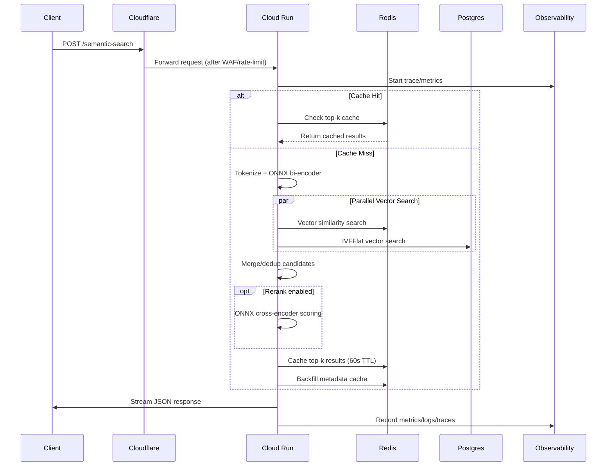

# Design Document

## Overview

The RAG-Search API is designed as a high-performance, production-ready microservice that provides semantic search capabilities with sub-100ms latency and 99.9% availability. The system uses a multi-tier caching architecture with vector embeddings, implements comprehensive observability, and includes full compliance controls for GDPR and SOC-2.

The core architecture follows a request-response pattern with parallel vector search across Redis and Postgres, optional cross-encoder reranking, and intelligent caching strategies to optimize performance.

## Architecture

### High-Level Architecture

```
Client Request
    ↓
Cloudflare (WAF + Rate Limiting)
    ↓
Cloud Run (Rust Binary)
    ├── Redis (Vector Cache + Top-K Cache)
    └── Postgres (Knowledge Base + pgvector)
    ↓
Observability Stack (Prometheus + Grafana + Loki + Jaeger)
```

### Component Interaction Flow



## Components and Interfaces

### 1. HTTP/gRPC Server Layer

**Technology Stack:**
- **Axum**: HTTP server framework for Rust with excellent performance and ergonomics
- **Tonic**: gRPC implementation for streaming endpoints
- **Tokio**: Multi-threaded async runtime (4 workers)

**Key Components:**
- `SearchHandler`: Processes HTTP POST requests to `/semantic-search`
- `GrpcSearchService`: Implements streaming gRPC SemanticSearch endpoint
- `RequestValidator`: Validates input parameters (query, k ≤ 50, filters)
- `ResponseSerializer`: Formats JSON/NDJSON responses with proper error codes

**Interface Definition:**
```rust
#[derive(Deserialize)]
pub struct SearchRequest {
    pub query: String,
    pub k: u32,           // max 50
    pub min_score: f32,   // optional threshold
    pub rerank: bool,     // enable cross-encoder
    pub filters: Option<SearchFilters>,
}

#[derive(Deserialize)]
pub struct SearchFilters {
    pub language: Option<String>,
    pub frozen: Option<bool>,
}

#[derive(Serialize)]
pub struct SearchResponse {
    pub post_id: String,
    pub title: String,
    pub snippet: String,
    pub score: f32,
    pub meta: PostMetadata,
}
```

### 2. ML Inference Engine

**Technology Stack:**
- **ort (ONNX Runtime)**: CPU-optimized inference with 4 threads
- **hf-tokenizers**: Rust-native tokenization
- **Model Management**: SHA256 verification with GCS download

**Key Components:**
- `BiEncoder`: all-MiniLM-L6-v2 (23MB, 384-D embeddings, 0.9ms CPU)
- `CrossEncoder`: ms-marco-MiniLM-L-6-v2 (13MB, 0.7ms per pair)
- `TokenizerService`: Text preprocessing and tokenization
- `ModelLoader`: Startup model download with hash verification

**Design Decisions:**
- Models downloaded at startup from `gs://prod-models/v1/` with SHA256 verification
- CPU-only inference to avoid GPU cold start latency
- Thread pool isolation to prevent inference blocking I/O operations
- Embedding caching to avoid recomputation for identical queries

### 3. Vector Search Layer

**Redis Vector Search:**
- **Technology**: Upstash Redis with HNSW indexing
- **Configuration**: 3GB memory, TLS, read replicas, EF_RUNTIME=200
- **Key Pattern**: `search:vec:<post_id>` for vector storage
- **Search Limit**: 100 candidates per query

**Postgres Vector Search:**
- **Technology**: Supabase Postgres with pgvector extension
- **Index**: IVFFlat with lists=100, probes=10
- **Connection**: tokio-postgres with deadpool (max 12 connections per container)
- **Timeout**: statement_timeout 500ms

**Parallel Search Strategy:**
```rust
async fn parallel_vector_search(query_vec: &[f32]) -> Result<Vec<Candidate>> {
    let (redis_future, postgres_future) = tokio::join!(
        redis_vector_search(query_vec, 100),
        postgres_vector_search(query_vec, 100)
    );
    
    let mut candidates = merge_and_dedup(redis_future?, postgres_future?);
    candidates.truncate(130); // max candidates
    Ok(candidates)
}
```

### 4. Caching Strategy

**Three-Tier Cache Architecture:**

1. **Vector Cache (Permanent)**
   - Key: `search:vec:<post_id>`
   - Value: 384-dimensional embedding vector
   - Eviction: LRU when memory limit reached
   - Purpose: Avoid recomputing embeddings

2. **Top-K Cache (60s TTL)**
   - Key: `farmhash64(normalize(query))`
   - Value: Serialized search results
   - TTL: 60 seconds
   - Purpose: Cache complete search results

3. **Metadata Cache (24h TTL)**
   - Key: `search:meta:<post_id>`
   - Value: Post metadata (title, author, URL, date)
   - TTL: 24 hours with LRU
   - Purpose: Avoid Postgres lookups for metadata

**Cache Consistency Strategy:**
- Strong consistency: Use Postgres replica timestamp for freshness
- Eventual consistency: Stale metadata acceptable with header indication
- Cache invalidation: Pub/Sub for post deletions (GDPR compliance)

### 5. Reliability and Circuit Breaking

**Circuit Breaker Pattern:**
```rust
pub struct CircuitBreaker {
    redis_failures: AtomicU32,
    postgres_failures: AtomicU32,
    state: AtomicU8, // Open, HalfOpen, Closed
}

impl SearchService {
    async fn search_with_fallback(&self, query: &str) -> Result<Vec<SearchResult>> {
        if self.circuit_breaker.redis_open() {
            // Redis circuit open - use Postgres only
            return self.postgres_only_search(query).await;
        }
        
        match self.hybrid_search(query).await {
            Ok(results) => {
                self.circuit_breaker.record_success();
                Ok(results)
            }
            Err(e) if e.is_redis_error() => {
                self.circuit_breaker.record_redis_failure();
                self.postgres_only_search(query).await
            }
            Err(e) => Err(e),
        }
    }
}
```

**Retry Strategy:**
- Exponential backoff: 100ms, 200ms, 400ms
- Maximum 3 retries for idempotent operations
- Jitter to prevent thundering herd
- Circuit breaker integration

## Data Models

### Core Data Structures

```rust
#[derive(Debug, Clone)]
pub struct Post {
    pub id: Uuid,
    pub post_id: String,
    pub title: String,
    pub content: String,
    pub author_name: String,
    pub language: String,
    pub frozen: bool,
    pub date_gmt: DateTime<Utc>,
    pub embedding: Vec<f32>, // 384 dimensions
}

#[derive(Debug, Clone)]
pub struct SearchCandidate {
    pub post_id: String,
    pub score: f32,
    pub source: SearchSource, // Redis or Postgres
}

#[derive(Debug, Clone)]
pub struct CachedResult {
    pub post_id: String,
    pub title: String,
    pub snippet: String,
    pub score: f32,
    pub cached_at: DateTime<Utc>,
}
```

### Database Schema

**Postgres Schema:**
```sql
CREATE TABLE posts (
    id UUID PRIMARY KEY DEFAULT gen_random_uuid(),
    post_id VARCHAR(255) UNIQUE NOT NULL,
    title TEXT NOT NULL,
    content TEXT NOT NULL,
    author_name VARCHAR(255) NOT NULL,
    language VARCHAR(10) NOT NULL DEFAULT 'en',
    frozen BOOLEAN NOT NULL DEFAULT false,
    date_gmt TIMESTAMP WITH TIME ZONE NOT NULL,
    embedding vector(384) NOT NULL
);

-- Indexes
CREATE INDEX CONCURRENTLY idx_posts_embedding_ivfflat 
ON posts USING ivfflat (embedding vector_cosine_ops) 
WITH (lists = 100);

CREATE INDEX CONCURRENTLY idx_posts_filters 
ON posts (language, frozen, date_gmt) 
WHERE NOT frozen;

CREATE INDEX CONCURRENTLY idx_posts_post_id 
ON posts (post_id);
```

**Redis Schema:**
```
# Vector storage
search:vec:<post_id> -> [f32; 384]  # Permanent, LRU eviction

# Top-k cache  
search:topk:<query_hash> -> JSON    # TTL 60s

# Metadata cache
search:meta:<post_id> -> JSON       # TTL 24h
```

## Error Handling

### Error Classification

```rust
#[derive(Debug, thiserror::Error)]
pub enum SearchError {
    #[error("Invalid request: {0}")]
    InvalidRequest(String),           // 400 Bad Request
    
    #[error("Rate limit exceeded")]
    RateLimitExceeded,               // 429 Too Many Requests
    
    #[error("Request timeout")]
    Timeout,                         // 504 Gateway Timeout
    
    #[error("Redis connection failed: {0}")]
    RedisError(String),              // Fallback to Postgres
    
    #[error("Database error: {0}")]
    DatabaseError(String),           // 500 Internal Server Error
    
    #[error("Model inference failed: {0}")]
    ModelError(String),              // 500 Internal Server Error
}
```

### Error Recovery Strategies

1. **Redis Failures**: Automatic fallback to Postgres-only search
2. **Postgres Timeouts**: Return partial results with warning header
3. **Model Inference Errors**: Retry with exponential backoff, then fail fast
4. **Rate Limiting**: Return 429 with Retry-After header
5. **Validation Errors**: Return 400 with detailed error message

### Graceful Degradation

```rust
pub enum SearchMode {
    Full,           // Redis + Postgres + Rerank
    PostgresOnly,   // Postgres only (Redis circuit open)
    CacheOnly,      // Redis cache only (Postgres timeout)
    Degraded,       // No reranking (model inference issues)
}
```

## Testing Strategy

### Unit Testing (≥80% Coverage)

**Core Components to Test:**
- `TokenizerService`: Text preprocessing and tokenization
- `BiEncoder`/`CrossEncoder`: Model inference with mock ONNX runtime
- `VectorSearch`: Redis and Postgres search logic
- `CacheManager`: Cache hit/miss scenarios and TTL behavior
- `CircuitBreaker`: State transitions and failure thresholds
- `RequestValidator`: Input validation and sanitization

**Test Structure:**
```rust
#[cfg(test)]
mod tests {
    use super::*;
    use mockall::predicate::*;
    
    #[tokio::test]
    async fn test_search_with_redis_fallback() {
        let mut mock_redis = MockRedisClient::new();
        mock_redis.expect_vector_search()
            .returning(|_| Err(RedisError::ConnectionFailed));
            
        let service = SearchService::new(mock_redis, mock_postgres);
        let result = service.search("test query").await;
        
        assert!(result.is_ok());
        assert_eq!(result.unwrap().len(), 10);
    }
}
```

### Integration Testing

**Test Scenarios:**
- Redis unavailable → Postgres fallback
- Postgres timeout → Partial results
- Malformed queries → 400 errors
- Rate limiting → 429 responses
- Filter edge cases → Correct result filtering
- GDPR deletion workflow → Cache purge verification

**Test Environment:**
- Testcontainers for Redis and Postgres
- Mock ONNX models for faster test execution
- Wiremock for external service simulation

### Load Testing (k6)

**Performance Test Suite:**
```javascript
// k6 load test configuration
export let options = {
  stages: [
    { duration: '2m', target: 1000 },   // Ramp up
    { duration: '10m', target: 10000 }, // Sustained load
    { duration: '2m', target: 20000 },  // Spike test
    { duration: '5m', target: 0 },      // Ramp down
  ],
  thresholds: {
    http_req_duration: ['p(95)<200'],   // 95% under 200ms
    http_req_failed: ['rate<0.01'],     // Error rate < 1%
  },
};
```

**Test Scenarios:**
- 10k RPS sustained load for 10 minutes
- 20k RPS spike test
- Connection storm (rapid connect/disconnect)
- Cache invalidation under load
- Cross-region failover simulation

### Chaos Testing

**Chaos Engineering Scenarios:**
- CPU throttling during peak load
- Memory pressure simulation
- Network partitions between services
- Redis replica failure
- Postgres connection pool exhaustion
- Model inference timeout simulation

## Security Considerations

### Authentication and Authorization

- **Service-to-Service**: mTLS between Cloud Run and Redis
- **IAM**: Least-privilege service accounts with no static keys
- **Secret Management**: Google Secret Manager with 90-day rotation
- **Network Security**: VPC-native networking with private IPs

### Data Protection

**GDPR Compliance:**
```rust
pub struct GdprService {
    redis_client: RedisClient,
    audit_logger: AuditLogger,
}

impl GdprService {
    pub async fn delete_post_data(&self, post_id: &str) -> Result<()> {
        // Delete from Redis caches
        let keys = vec![
            format!("search:vec:{}", post_id),
            format!("search:meta:{}", post_id),
        ];
        
        self.redis_client.unlink(&keys).await?;
        
        // Log deletion for audit trail
        self.audit_logger.log_deletion(post_id, Utc::now()).await?;
        
        Ok(())
    }
}
```

**Data Minimization:**
- Store only essential fields: post_id, title, snippet (≤300 chars), author_name, url, date
- No query text storage beyond 60-second cache TTL
- Automatic purge of expired cache entries

### Input Validation and Sanitization

```rust
pub fn validate_search_request(req: &SearchRequest) -> Result<(), ValidationError> {
    if req.query.is_empty() || req.query.len() > 1000 {
        return Err(ValidationError::InvalidQuery);
    }
    
    if req.k == 0 || req.k > 50 {
        return Err(ValidationError::InvalidK);
    }
    
    if let Some(score) = req.min_score {
        if score < 0.0 || score > 1.0 {
            return Err(ValidationError::InvalidScore);
        }
    }
    
    Ok(())
}
```

This design provides a comprehensive foundation for implementing a production-ready semantic search API with high performance, reliability, and compliance requirements.